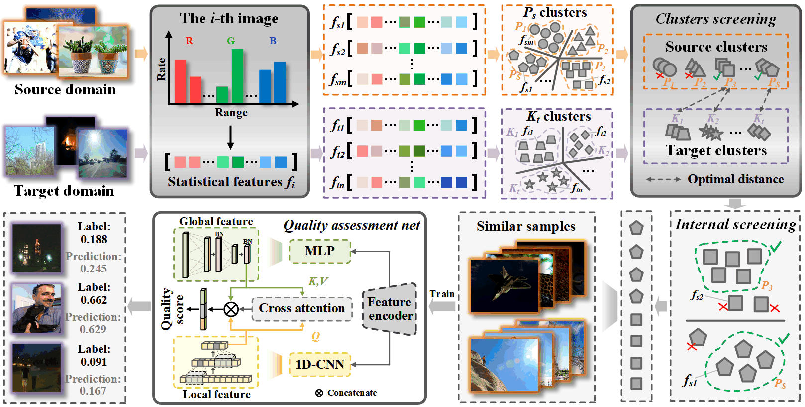

# USCQA
a cross-domain image quality assessment method
Code for USCQA


## Dataset
| Dataset   | Links                                                       |
| --------- | ----------------------------------------------------------- |
| TID2013      | http://www.ponomarenko.info/tid2013.htm     |
| KADID10K      | http://database.mmsp-kn.de/kadid-10k-database.html      |
| LIVE-C      | https://live.ece.utexas.edu/research/ChallengeDB/index.html      |
| CSIQ      | https://s2.smu.edu/~eclarson/csiq.html |
| KonIQ-10k   | http://database.mmsp-kn.de/koniq-10k-database.html |
| AGIQA     |  https://github.com/lcysyzxdxc/AGIQA-3k-Database |
## Requirements
- PyTorch=1.7.0
- Torchvision=0.8.1
- numpy=1.21.6
- scipy=1.7.3
- h5py=3.7.0
- opencv-python =4.7.0.72
- need to updown the weights of ViT, and name is with "pytorch_model.bin".
## Usages

### Screen source domain images for the target domain
```
similar_livec_kadid.py
```

You will get screened source domain datasets, and these datasets are inputs of the model.
```
image_labeled_by_score.csv
```
The cluster number of the source domain is dynamic with the scale of the source domain.

####  Q1  When deal with the target domain
```
domain_kadid_part_to_livec.py
```
Then a quality model will be trained for the target domain.


Some available options:
* `--lr`: Learning rate.
* `--save_path`: Model and paramter save path.
* `--batch_size`: Batch size.
* `--epochs`:Epochs
* 
```
